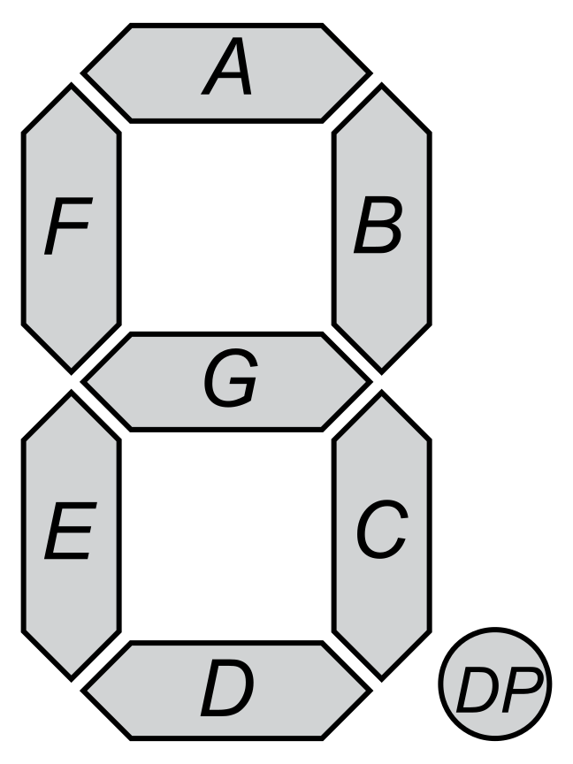

# Active High 7 Segment Decoder

### 7 Segment Decoder

Every digit from 0 to 9 can be displayed using the 7 segments labelled a through g as follows:

### Input

4 bit number ranging from 0 to 9

### Output

7 bit number with MSB corresponding to A and LSB to G. The output is in accordance with the definiton of the active high condition, with

1 = ON

0 = OFF